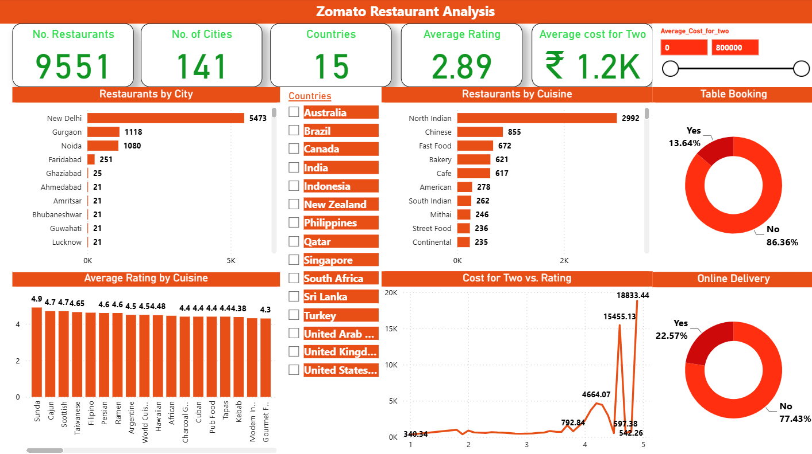

# 🍽️ Zomato Data Analysis Dashboard – Power BI

## 📊 Project Overview

This project presents an interactive **Zomato Data Analysis Dashboard** built using **Microsoft Power BI**.

The dashboard transforms Zomato restaurant data into meaningful visual insights, allowing users to explore restaurant distribution, ratings, cuisines, locations, pricing, and other key business metrics.

The objective of this project is to demonstrate practical skills in **data analysis, data visualization, data cleaning, and business intelligence using Power BI**.

---

## 📂 Data Source

The analysis is based on a Zomato restaurant dataset containing information about restaurants, locations, cuisines, ratings, pricing, table booking, and online delivery.

The dataset was cleaned and transformed using Power Query before being used for analysis and dashboard development in Power BI.

---

## 🎯 Business Questions

This project explores the following business questions:

1. Which country has the highest number of restaurants listed?
2. Which cities have the highest number of restaurants?
3. Which cuisines have the highest number of restaurants?
4. How does the average rating vary by cuisine?
5. How many restaurants offer table booking?
6. How many restaurants offer online delivery?
7. What relationship can be observed between the cost for two and restaurant ratings?

---

## 🎯 Project Objectives

- Analyze restaurant distribution across locations
- Understand restaurant ratings and customer preferences
- Analyze cuisines and restaurant categories
- Explore pricing and restaurant cost patterns
- Identify key trends and patterns in the restaurant data
- Build an interactive dashboard for business-oriented analysis

---

## 🛠️ Tools & Technologies

- **Microsoft Power BI**
- **Power Query**
- **DAX**
- **Data Cleaning & Transformation**
- **Data Modeling**
- **Data Visualization**

---

## 📈 Dashboard Features

The Power BI dashboard provides interactive analysis through:

- Restaurant analysis
- Location-based analysis
- Rating analysis
- Cuisine analysis
- Pricing analysis
- Interactive filters and slicers
- KPI cards
- Charts and visualizations

Users can interact with the dashboard to explore different aspects of the Zomato restaurant dataset.

---

## 🔄 Data Preparation

The data was prepared and transformed using **Power Query** before creating the dashboard.

The data preparation process included:

- Cleaning and transforming raw data
- Handling missing and inconsistent values
- Standardizing columns and data types
- Preparing data for analysis
- Creating relationships and a suitable data model

---

## 🧮 DAX & Data Analysis

DAX measures and calculated fields were used to create analytical metrics and support interactive dashboard analysis.

The project demonstrates the use of:

- Measures
- Calculated columns
- Aggregations
- Filtering and context
- KPI calculations

---

## 📊 Dashboard Preview

### Zomato Restaurant Analysis Dashboard

---

## 💡 Key Insights

Based on the dashboard analysis:

- The dataset contains **9,551 restaurants** across **141 cities** and **15 countries**.
- **New Delhi** has the highest number of restaurants in the dataset, followed by **Gurgaon** and **Noida**.
- **North Indian** cuisine has the highest restaurant count among the cuisines shown.
- The overall average restaurant rating is **2.89**.
- The average cost for two is approximately **₹1.2K**.
- **13.64%** of restaurants offer table booking, while **86.36%** do not.
- **22.57%** of restaurants offer online delivery, while **77.43%** do not.

---

## 📁 Project Files

| File | Description |
|------|-------------|
| `Brijesh_Zomato Data Dashboard.pbix` | Power BI dashboard and data model |

---

## 💡 Skills Demonstrated

- Data Analysis
- Data Cleaning
- Power Query
- DAX
- Data Modeling
- Data Visualization
- Business Intelligence
- Dashboard Development
- Interactive Reporting

---

## 👨‍💻 Author

**Brijesh Amin**

Aspiring Data Analyst | Power BI | SQL | Excel | Python

---

## ⭐ Project

This project was created as part of my **Data Analytics portfolio** to demonstrate practical Power BI and business intelligence skills.
